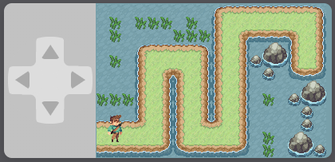
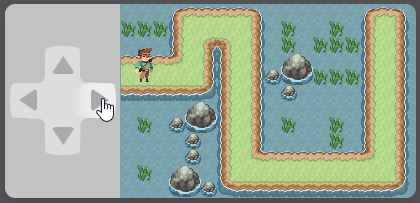

<h1 align="center">VerifyJs</h1>
<div align="center">

A lightweight simple puzzle verification plugin.


</div>

Verify randomly generates a path for the user to follow using the on screen d-pad.

 

## Installation
Add `verify.js` to your project.
```html
<script src="verify.js"></script>
```
You can get the corresponding CDN link from [unpkg](https://unpkg.com/browse/@andypagdin/verify/).

VerifyJs is available via [npm](https://www.npmjs.com/package/@andypagdin/verify).
```sh
npm install @andypagdin/verify --save
```

## Usage
Simply call `action()` to activate the verification modal.
```js
Verify.action((result, message) => {
  console.log(result, message);
});
```
`result` will return 3 different codes:

- `0`: Verify failed.
- `1`: Verify successful.
- `2`: Modal was closed before verification was able to complete.

`message` will return 3 different strings:

- `Incorrect move $move_direction`
- `Verification successful`
- `Modal closed before verification complete`